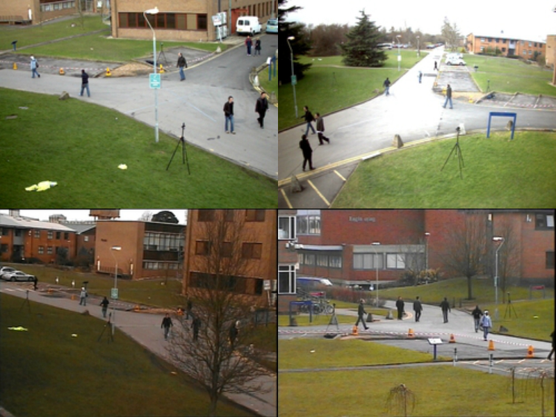
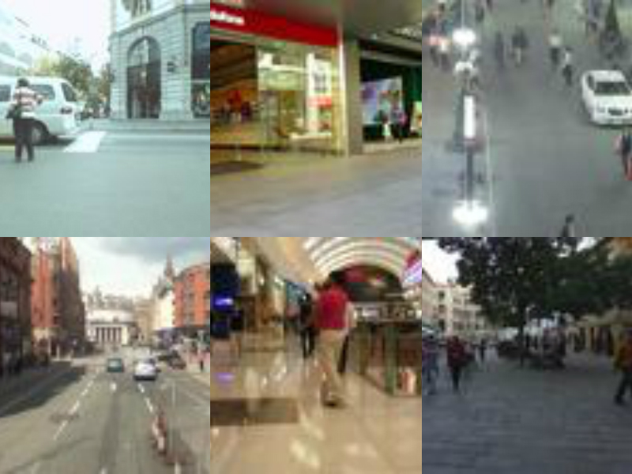
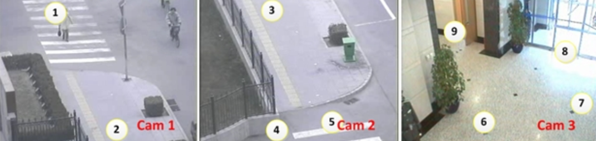

# multiple_object_tracking_paper_list
Recent paper collection on MOT/MTMCT/ pose tracking/facing tracking

Refer to [SpederXu](https://github.com/SpyderXu/multi-object-tracking-paper-list)

------
## Dataset
|Dataset name| Description | paper | link| samples|
|:----:|:----:|:-----:|:------|:----:|
|PTES09|The datasets are multisensor sequences containing  different crowd activities. Some sequnces are included in MOT15| | [link](http://www.cvg.reading.ac.uk/PETS2009/a.html) ||
|MOT15|This dataset includes sequneces from PETS09, KITTI, ETH, ... |[paper](https://arxiv.org/abs/1504.01942)|[link](https://motchallenge.net/data/2D_MOT_2015/)||
|MOT16|This benchmark contains 14 challenging video sequences (7 training, 7 test) in unconstrained environments filmed with both static and moving cameras. Tracking and evaluation are done in image coordinates. All sequences have been annotated with high accuracy, strictly following a well-defined protocol.|[paper](https://arxiv.org/abs/1603.00831)|[link](https://motchallenge.net/data/MOT16/)||
|MOT17|MOT17 Challenge. All MOT16 sequences are used with a new, more accurate ground truth. Each sequences is provided with 3 sets of detections: DPM, Faster-RCNN, and SDP.||[link](https://motchallenge.net/data/MOT17/)||
|DUKE_MTMCT|DukeMTMC aims to accelerate advances in multi-target multi-camera tracking. It provides a tracking system that works within and across cameras, a new large scale HD video data set recorded by 8 synchronized cameras with more than 7,000 single camera trajectories and over 2,000 unique identities, and a new performance evaluation method that measures how often a system is correct about who is where.|[paper](https://users.cs.duke.edu/~tomasi/papers/ristani/ristaniBmtt16.pdf)|[link](http://vision.cs.duke.edu/DukeMTMC/)||
|NLPR_MCT|An equalised global graphical model based approach for multi-camera object tracking|[paper](https://arxiv.org/pdf/1502.03532.pdf)|[link](http://mct.idealtest.org/Datasets.html)||
-----
## Performance Measures

MOTA from [CLEAR MOT](https://link.springer.com/content/pdf/10.1155/2008/246309.pdf)

IDF1 from [DUKE MTMCT](https://users.cs.duke.edu/~tomasi/papers/ristani/ristaniBmtt16.pdf)

DETRAC MOT metrics from [UA-DETRAC](http://detrac-db.rit.albany.edu/Tracking)

-----
## Papers

### Overview
|Title | Tags | Paper |
|:-----:|:-----:|:------:|
|Tracking the Trackers:An Analysis of the State of the Art in Multiple Object Tracking|<kbd>Tracker comparing</kbd> <kbd>Standardized benchmark</kbd>||

### MOTA

|Title|   Performance   | Tags | Paper |
|:-----:|:-----:|:-----:|:------:|
| Multiple People Tracking Using Hierarchical Deep Tracklet Re-identification|MOTA 53.6 on MOT16 PUBLIC   MOTA 54.1 on MOT17 | <kbd>Offline</kbd>  <kbd>Graph cut</kbd> <kbd>ReID</kbd> <kbd>Spatio-temporal Feature</kbd> <kbd>tracklet based</kbd>  <kbd>cluster</kbd> <kbd>RNN</kbd>| [paper](https://arxiv.org/pdf/1811.04091.pdf) |
| Online Multi-Object Tracking with Instance-Aware Tracker and Dynamic Model Refreshment|MOTA 38.9 on MOT15 PUBLIC  MOTA 48.8 on MOT16 | <kbd>Online</kbd> <kbd>SOT</kbd> <kbd> reinforcement learning</kbd> <kbd>KCF</kbd> <kbd>ReID</kbd> <kbd>Multi-cut</kbd>| [paper](https://arxiv.org/pdf/1902.08231.pdf) |
| Online Multi-Object Tracking with Historical Appearance Matching and Scene Adaptive Detection Filtering|MOTA 28.6 on MOT15 PUBLIC  MOTA 48.3 on MOT17 | <kbd>Online</kbd> <kbd>Historical appearance</kbd> <kbd>Scene adaptive</kbd> <kbd>Siamise network</kbd> | [paper](https://arxiv.org/pdf/1811.04091.pdf) |
### IDF1

|Title|Performance | Tags | Paper |
|:-----:|:-----:|:-----:|:------:|
|Multiple Hypothesis Tracking Algorithm for Multi-Target Multi-Camera Tracking with Disjoint Views |IDF1 80.3 on single easy   IDF1 65.4 on multiple easy   IDF1 63.5 on single hard   IDF1 50.1 on multiple hard| <kbd>MHT</kbd> <kbd>Jointly SCT and MCT</kbd> <kbd>Tracking score</kbd>| |

### Pose Track

|Title|Performance | Tags | Paper |
|:-----:|:-----:|:-----:|:------:|

### Multi-Face Track

|Title|Performance | Tags | Paper |
|:-----:|:-----:|:-----:|:------:|

